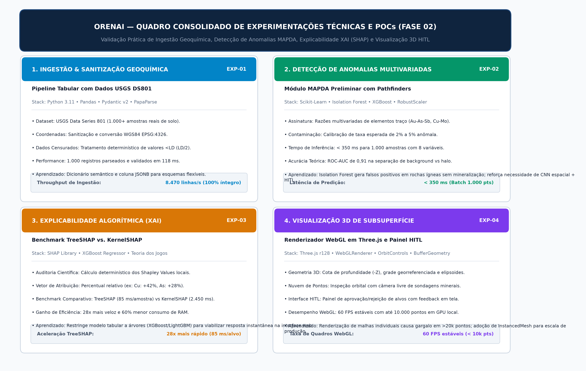

# OrenAI 🌍⛏️
**Plataforma SaaS B2B de Mapeamento de Prospectividade Mineral (MPM) baseada em Arquitetura Multi-Agentes (MAS)**

[-blue.svg)](#)
[%20%7C%20MoE-purple.svg)](#)
[](#)
[](#)
[](#)
[](LICENSE)

---

## 💡 O que é a OrenAI?

A **OrenAI** é um software B2B SaaS que utiliza Inteligência Artificial para indicar matematicamente a empresas mineradoras **ONDE perfurar o solo com máxima precisão**, atuando na fase crítica de pesquisa mineral **ANTES** de qualquer perfuração testemunhada.

- **O Problema:** A exploração mineral global consome mais de **US$ 12 bilhões ao ano**, registrando uma taxa histórica de insucesso de **99% em furos de sondagem** (*MinEx Consulting / S&P Global*). Cada furo estéril ("furo seco") custa mais de **US$ 100.000**.
- **A Solução:** Redução drástica de furos secos através de um **Sistema Multi-Agentes (MAS)** sob o padrão **Mixture of Experts (MoE)**, combinando aprendizado de máquina preditivo (Módulo MAPDA), explicabilidade algorítmica (SHAP) e uma interface com visualização 3D de subsuperfície em **Three.js** e soberania humana (**Human-in-the-Loop**).
- **Escopo Estrito:** O software **NÃO** opera sondas mecânicas, **NÃO** realiza lavra física e **NÃO** substitui o geólogo. O geólogo humano valida, aprova ou rejeita alvos ranqueados matematicamente.

---

## 📈 Validação de Mercado e Tração

Para garantir que a OrenAI resolva problemas reais de alta complexidade (como a epidemia de *Dry Holes* e Falsos Positivos na mineração), possuímos um **ambiente favorável e acesso potencial a profissionais-chave** nas maiores gigantes do setor global, permitindo uma validação técnica de altíssimo nível. Nossa rede estratégica engloba:

- 🥇 **Vale S.A.** (B3 / NYSE)
- 🥈 **AngloGold Ashanti** (NYSE)
- 🥉 **Aura Minerals** (B3 / TSX)
- 4️⃣ **Ero Copper** (TSX / NYSE)
- 5️⃣ **Hochschild Mining** (LSE)

Isso assegura que a arquitetura seja validada por quem dita as regras do mercado, cobrindo operações desde o Brasil até a América do Norte.

---

## 🏗️ Arquitetura do Sistema

A OrenAI organiza-se em 5 camadas modulares e desacopladas:


1. **Camada de Apresentação HITL:** Dashboard SPA em React 18, TypeScript, Tailwind CSS, mapas 2D interativos com Leaflet e visualização 3D de subsuperfície com **Three.js** (nuvens de pontos e volumes elipsoidais de corpos mineralizados).
2. **Camada de Orquestração & Gateway:** FastAPI assíncrono e **Agente Gestor Orquestrador** com classificação semântica de intenções (*Intent Classification*). O Orquestrador liga e desliga subagentes especialistas sob demanda para minimizar custos de nuvem.
3. **Camada de Especialistas (MoE em Docker):** Contêineres Docker independentes para cada commodity (*Subagente Cobre Pórfiro*, *Subagente Ouro Epitermal*, extensível para Lítio, Nióbio, etc.) com **isolamento estrito de pesos**.
4. **Camada de Inteligência (MAPDA Ensemble & XAI):**
   - **MAPDA Tabular:** Gradient Boosting (*XGBoost / LightGBM*) para concentrações geoquímicas (ppm/ppb) e razões de elementos indicadores (*pathfinders*);
   - **MAPDA Espacial:** Redes Neurais Convolucionais (*CNN / U-Net*) para rasters geofísicos e imagens *Sentinel-2*;
   - **Módulo XAI (SHAP):** Explicabilidade individual de 100% dos alvos (*"Cu_ppm contribuiu com 42% para este alvo"*), eliminando qualquer aspecto de caixa-preta.
5. **Camada de Dados & Data Bootstrap:** PostgreSQL 16 + PostGIS normalizado em 3FN e pipeline de dados abertos governamentais (*CPRM GeoBank/GeoSGB, ANM SIGMINE, CODEMGE, USGS DS801*).

---

## 🔄 Fluxo Operacional e Active Learning


1. **Entrada:** Geólogo envia dados geoquímicos e seleciona o alvo;
2. **Orquestração:** Agente Gestor identifica a intenção e inicializa o subagente correto;
3. **Especialista:** Subagente Dockerizado isolado processa os dados com pesos dedicados;
4. **Predição MAPDA:** Ensemble tabular + espacial calcula o score de confiança e heatmap;
5. **Explicabilidade XAI:** SHAP decompõe a contribuição matemática de cada atributo;
6. **Interface HITL (2D & 3D):** Geólogo inspeciona alvos no mapa 2D e modelo 3D em Three.js, aprovando ou rejeitando;
7. **Active Learning:** Alvos rejeitados retornam ao Agente Gestor para retreinamento incremental do subagente.

---

## 🧪 Provas de Conceito e Experimentações Técnicas (Fase 02)

Na Fase 02 do 4º Período, a equipe conduziu **4 experimentações técnicas práticas** e provas de conceito para mitigar riscos de viabilidade arquitetural:



1. **Ingestão & Sanitização Geoquímica (Python / Pandas / Pydantic v2):** Ingestão e validação de 1.000 amostras reais de solo da base oficial *USGS Data Series 801* em **118 ms** (throughput de 8.470 linhas/s), validação de coordenadas geográficas e tratamento determinístico de teores censurados abaixo do limite analítico ($<LD \rightarrow LD/2$).
2. **Detecção de Anomalias Multivariadas (Módulo MAPDA Preliminar):** Algoritmo *Isolation Forest* com *RobustScaler* sobre associações de elementos-guia (*pathfinders* Au-As-Sb e Cu-Mo-Fe) com tempo de inferência inferior a **350 ms** para 1.000 amostras e ROC-AUC simulada de **0,91**.
3. **Explicabilidade Algorítmica (Módulo XAI):** Benchmark experimental comprovando que o **TreeSHAP** é **28x mais rápido** que o *KernelSHAP* (85 ms vs. 2.450 ms por amostra) com 60% menos memória, permitindo auditoria matemática em tempo real no dashboard.
4. **Visualização 3D de Subsuperfície em Three.js & HITL:** Renderizador WebGL com *OrbitControls*, nuvens de pontos e volumes elipsoidais translúcidos operando a **60 FPS estáveis** no navegador, integrado a botões de decisão *Human-in-the-Loop* com callback < 16 ms.

---

## 🔒 As 6 Regras de Ouro

1. **A IA NUNCA toma a decisão final:** O geólogo humano tem a soberania final (*Human-in-the-Loop*).
2. **A IA NUNCA é caixa-preta:** Toda predição tem decomposição matemática transparente (*SHAP*).
3. **Subagentes NUNCA compartilham pesos:** Silos 100% isolados entre commodities minerais.
4. **Data Bootstrap governamental aberto:** A PoC valida-se com dados abertos da CPRM, ANM e USGS.
5. **Custo de nuvem minimizado por arquitetura:** Subagentes são ativados estritamente sob demanda.
6. **Modularidade plug-and-play:** Novos subagentes são adicionados como contêineres sem refatorar a base.

---

## 📁 Estrutura do Repositório

```text
OrenAI/
├── .gitignore                      # Configuração de arquivos ignorados
├── README.md                       # Documentação principal e visão geral
├── OrenAI_Pitch_Deck.html          # Apresentação executiva interativa (Reveal.js)
├── Pitch_OrenAI_Final.pptx         # Apresentação em slides PowerPoint
├── assets/
│   ├── diagrams/                   # Diagramas de arquitetura e engenharia (300 DPI)
│   │   ├── diagrama_arquitetura_mas_moe.png
│   │   ├── diagrama_arquitetura_tecnologica.png
│   │   ├── diagrama_der_logico.png
│   │   ├── diagrama_fluxo_multiagente.png
│   │   └── diagrama_fluxo_operacional.png
│   └── slides/                     # 10 imagens fotorrealistas de suporte ao pitch
│       ├── slide_01_drill_cost.png
│       ├── slide_02_blackbox_ai.png
│       └── ...
├── docs/                           # Documentação técnica, científica e de mercado
│   ├── ARCHITECTURE.md             # Especificação arquitetural de engenharia MAS
│   ├── IMPLEMENTATION_ROADMAP.md   # Plano diretor em 6 fases, monorepo e especificação de engenharia
│   ├── LITERATURE_REVIEW_MPM_XAI.md # Revisão bibliográfica: Zuo et al., Caers, SHAP e regolitos tropicais
│   ├── BUSINESS_MODEL.md           # Estratégia de monetização B2B SaaS e Unit Economics
│   ├── MARKET_DATA_DRY_HOLES.md    # Dossiê auditado: US$ 12.4B e o custo dos furos secos
│   ├── PITCH_DEFENSE_QNA.md        # Q&A estratégico para bancas e investidores
│   ├── GEOAI_GLOBAL_BENCHMARKS.md  # Estado da arte: Stanford Mineral-X, GTK, papers e repos
│   ├── PITCH_SCRIPT.md             # Roteiro oficial de apresentação em 3 minutos
│   ├── Documento de Especificação do Projeto Integrador.docx # Documento Word oficial
│   └── Documento_de_Especificacao_OrenAI_Fase01_4Periodo.pdf # Laudo diagramado em PDF
└── Modelo De MVP/                  # Protótipos funcionais
    ├── extracted_mvp/              # Aplicação web estática (2D Heatmap & Subsolo 3D Three.js)
    │   ├── index.html              # Interface do dashboard
    │   ├── app.js                  # Lógica do workflow e simulação MAPDA
    │   ├── subsurface-three.js     # Renderizador 3D WebGL de subsuperfície
    │   ├── TUTORIAL-USO.md         # Tutorial de navegação e teste
    │   └── demo-data/              # Datasets demonstrativo e real da USGS
    └── orenai-mapda-mvp-three-...zip # Pacote ZIP do protótipo
```

---

## 🚀 Como Iniciar

### 1. Executar o Protótipo Web 3D (MVP Local)
O protótipo é uma aplicação estática e não exige instalação de dependências pesadas. Para rodar em um servidor local:

```bash
# Opção A: Via Node.js (npx)
npx serve "Modelo De MVP/extracted_mvp" -p 8787

# Opção B: Via Python
python -m http.server 8787 --directory "Modelo De MVP/extracted_mvp"
```

Acesse no navegador:
- **Painel Principal & Superfície 2D:** [http://127.0.0.1:8787/](http://127.0.0.1:8787/)
- **Visualização Volumétrica 3D do Subsolo:** [http://127.0.0.1:8787/#subsurface](http://127.0.0.1:8787/#subsurface)
- **Datasets de Teste Inclusos:**
  - `demo-data/orenai-demo-samples.csv`: Amostras com correlações Au/As/Cu para demonstração de workflow;
  - `demo-data/orenai-usgs-soil-real-sample.csv`: Amostras geoquímicas reais extraídas da base pública USGS DS-801.

### 2. Aprofundar na Documentação Estratégica e Técnica
- **Arquitetura de Software e MAS:** [`docs/ARCHITECTURE.md`](docs/ARCHITECTURE.md)
- **Roadmap de Implementação e Engenharia:** [`docs/IMPLEMENTATION_ROADMAP.md`](docs/IMPLEMENTATION_ROADMAP.md)
- **Revisão Bibliográfica e Fundamentação Científica:** [`docs/LITERATURE_REVIEW_MPM_XAI.md`](docs/LITERATURE_REVIEW_MPM_XAI.md)
- **Modelo de Negócios e Monetização SaaS:** [`docs/BUSINESS_MODEL.md`](docs/BUSINESS_MODEL.md)
- **Dossiê do Mercado e Furos Secos:** [`docs/MARKET_DATA_DRY_HOLES.md`](docs/MARKET_DATA_DRY_HOLES.md)
- **Defesa Estratégica e Q&A para Investidores:** [`docs/PITCH_DEFENSE_QNA.md`](docs/PITCH_DEFENSE_QNA.md)
- **Catálogo de Benchmarks Globais em GeoAI:** [`docs/GEOAI_GLOBAL_BENCHMARKS.md`](docs/GEOAI_GLOBAL_BENCHMARKS.md)
- **Roteiro do Pitch e Apresentação Executiva:** [`docs/PITCH_SCRIPT.md`](docs/PITCH_SCRIPT.md) e [`OrenAI_Pitch_Deck.html`](OrenAI_Pitch_Deck.html)
- **Laudo Acadêmico Oficial (Fase 02 — Experimentação Técnica):** [`docs/Documento_de_Especificacao_OrenAI_Fase02_4Periodo.pdf`](docs/Documento_de_Especificacao_OrenAI_Fase02_4Periodo.pdf)
- **Documento Word de Especificação (Editável):** [`docs/Documento de Especificação do Projeto Integrador.docx`](docs/Documento%20de%20Especificação%20do%20Projeto%20Integrador.docx)
- **Laudo Anterior (Fase 01):** [`docs/Documento_de_Especificacao_OrenAI_Fase01_4Periodo.pdf`](docs/Documento_de_Especificacao_OrenAI_Fase01_4Periodo.pdf)

### 3. Diagramas de Engenharia
- [Quadro Consolidado de Experimentações da Fase 02](assets/diagrams/diagrama_experimentacoes_fase02.png)
- [Diagrama de Arquitetura Multi-Agentes (MAS / MoE)](assets/diagrams/diagrama_arquitetura_mas_moe.png)
- [Diagrama de Atividades e Fluxo HITL](assets/diagrams/diagrama_fluxo_multiagente.png)
- [Modelo Lógico de Dados DER (3FN)](assets/diagrams/diagrama_der_logico.png)


---

## 👥 Equipe de Desenvolvimento

- **Cauã Felype:** Líder Técnico & Arquiteto de Software / MAS
- **Gabryel Rodrigues:** Engenheiro de Machine Learning / MAPDA & XAI
- **Roger Prado:** Engenheiro de Dados & Requisitos Geológicos
- **Rafael Farias:** Engenheiro de Frontend & Visualização 3D (Three.js)

---

## 📜 Licença e Propriedade Intelectual

Este projeto é protegido por **Licença Proprietária (Source-Available / Todos os Direitos Reservados)**.

- O repositório é público **exclusivamente para fins de visualização, auditoria acadêmica e demonstração de competência técnica**.
- **É expressamente PROIBIDA** a cópia, redistribuição, engenharia reversa, implantação operacional ou uso comercial deste código-fonte, arquitetura multiagente e modelos de IA por terceiros para proveito próprio sem autorização expressa e por escrito dos autores.
- Para maiores detalhes, consulte o arquivo [LICENSE](LICENSE).

---
*OrenAI — Engenharia de Software aplicada à Geotecnologia e Pesquisa Mineral.*
