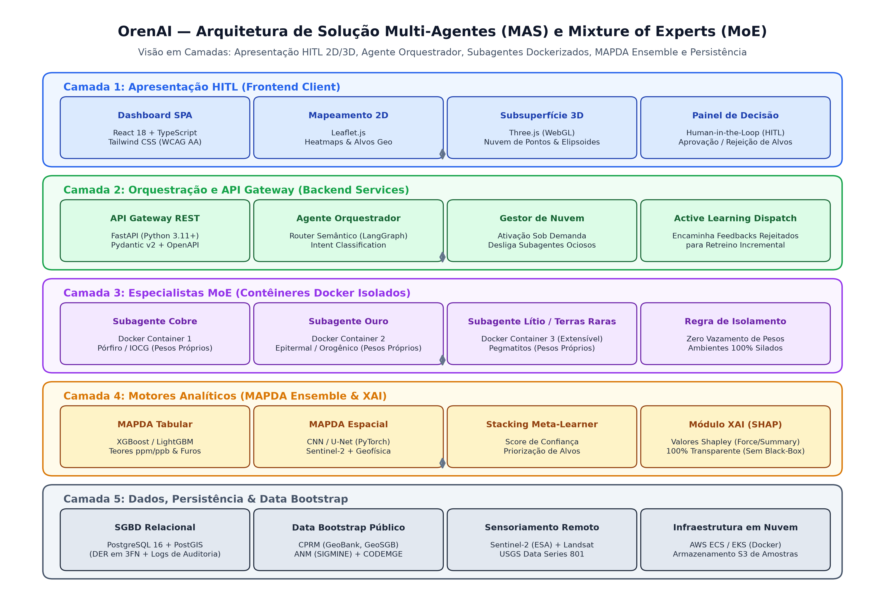
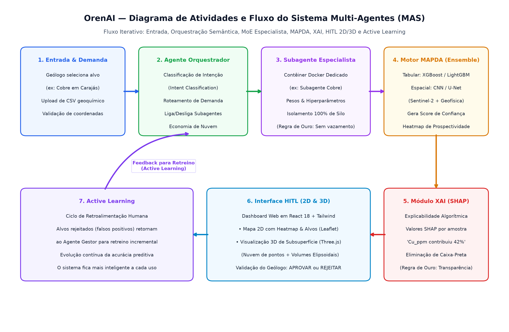
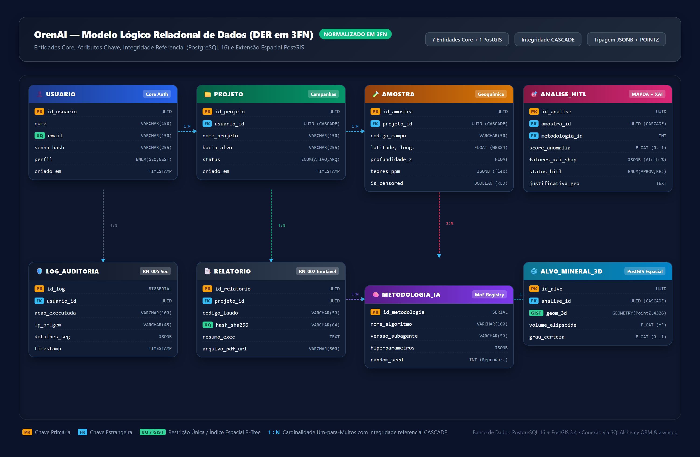

# OrenAI — Arquitetura de Software e Engenharia de Solução
**Plataforma SaaS B2B de Mapeamento de Prospectividade Mineral (MPM) baseada em Arquitetura Multi-Agentes (MAS)**

---

## 1. Visão do Produto e Missão

A **OrenAI** é uma plataforma B2B SaaS de inteligência artificial projetada para atuar diretamente na fase de **pesquisa mineral preliminar**, antes de qualquer perfuração, auxiliando mineradoras a identificar com rigor matemático onde perfurar o solo com máxima assertividade.

### 1.1 Contexto e Métricas do Setor
- **Dispêndio Global:** O setor mineral mundial gasta anualmente mais de **US$ 12 bilhões** em campanhas de exploração e sondagem.
- **Taxa de Insucesso Histórica:** Aproximadamente **99% dos furos de sondagem são estéreis** (furos secos), segundo estudos consolidados da *MinEx Consulting* e *S&P Global*.
- **Custo do Erro:** Cada furo de sondagem testemunhado estéril custa **mais de US$ 100.000** à empresa mineradora. Evitar apenas 10 furos secos resulta em uma economia direta de **US$ 1 milhão**.
- **O que a OrenAI FAZ:** Identifica matematicamente padrões e anomalias geoquímicas/espaciais, gera heatmaps de prospectividade e explica o porquê de cada alvo ser promissor.
- **O que a OrenAI NÃO FAZ:** NÃO opera sondas de perfuração, NÃO extrai minério e NÃO substitui o geólogo. O especialista humano toma sempre a decisão final (*Human-in-the-Loop*).

---

## 2. Arquitetura de Sistema: Multi-Agent System (MAS) & Mixture of Experts (MoE)

A OrenAI adota o padrão arquitetural **Mixture of Experts (MoE)** implementado sob a forma de um **Sistema Multi-Agentes (MAS)** desacoplado, modular e com execução sob demanda.

### 2.1 O Fluxo Operacional em 7 Etapas

1. **[ENTRADA & DEMANDA]:** O geólogo/cliente realiza o upload de dados geoquímicos tabulares (CSV/XLSX contendo coordenadas geográficas e concentrações de elementos em ppm/ppb) e submete a intenção de exploração (ex: *"Buscar anomalias de cobre do tipo Pórfiro em Carajás/PA"*).
2. **[AGENTE GESTOR ORQUESTRADOR]:** Ponto focal de orquestração implementado com *LangGraph* e lógica de classificação semântica de intenções (*Intent Classification*). O Orquestrador:
   - Identifica o mineral-alvo e o ambiente geológico;
   - Despacha a requisição para o subagente especialista correspondente;
   - Gerencia o ciclo de vida dos contêineres Docker: **ativa o subagente sob demanda e o desliga após o processamento**, cortando custos operacionais de nuvem em mais de 70%;
   - Não processa regras geológicas diretamente (atuação puramente orquestradora).
3. **[SUBAGENTE ESPECIALISTA MoE]:** Cada subagente é encapsulado em um **contêiner Docker independente** (ex: *Subagente Cobre Pórfiro*, *Subagente Ouro Epitermal*).
   - **Regra de Ouro Inviolável:** Isolamento estrito de pesos e hiperparâmetros. O modelo do Subagente Ouro **jamais** compartilha memória, dados de treino ou pesos sinápticos com o Subagente Cobre.
   - Modularidade plug-and-play: novos subagentes (*Lítio/Pegmatito*, *Nióbio*, *Terras Raras*) são plugados sem reescrever a base do sistema.
4. **[MÓDULO MAPDA (Motor Preditivo)]:** *Mineral Anomaly Pattern Detection Algorithm*, motor analítico híbrido em Stacking Ensemble:
   - **Camada Tabular:** Modelos de árvores de decisão impulsionadas (*XGBoost / LightGBM / CatBoost*) calibrados para concentrações de elementos (Au, Cu, Fe, As, Sb) e razões de elementos indicadores (*pathfinders*);
   - **Camada Espacial:** Redes Neurais Convolucionais (*CNN / U-Net / ResNet*) para extração de lineamentos e anomalias em rasters aerogeofísicos (magnetometria e radiometria) e imagens multiespectrais de satélite (*Sentinel-2*);
   - **Meta-Learner de Stacking:** Combina as probabilidades tabular e espacial gerando: (a) Score de Confiança por alvo ranqueado; (b) Mapa de Calor de Prospectividade Mineral; (c) Pesos matemáticos brutos da predição.
5. **[MÓDULO XAI (IA Explicável)]:** Aplicação do algoritmo **SHAP (SHapley Additive exPlanations)** fundamentado na Teoria dos Jogos Cooperativos:
   - Extrai valores Shapley individuais por amostra: *"Cu_ppm contribuiu com 42% para este alvo, As_ppm com 28%"*;
   - Gera gráficos explicáveis (Waterfall plots, Force plots e Summary plots);
   - Elimina totalmente o conceito de "caixa-preta", fornecendo ao geólogo a fundamentação científica necessária para justificar o investimento perante comitês e investidores.
6. **[INTERFACE HITL (Human-in-the-Loop) & VISUALIZAÇÃO 3D]:** Dashboard web de alta performance construído em React 18, Tailwind CSS e TypeScript:
   - **Mapeamento 2D:** Visualização de camadas georreferenciadas, alvos ranqueados e heatmaps com *Leaflet.js*;
   - **Subsuperfície 3D em Three.js:** Visualização volumétrica no navegador via WebGLRenderer, OrbitControls para rotação/zoom em 360°, representação de subsuperfície com nuvem de pontos e volumes elipsoidais simulando corpos mineralizados em profundidade;
   - **Painel de Decisão HITL:** O geólogo humano valida cada alvo, tendo a soberania de **APROVAR** ou **REJEITAR** a indicação da IA.
7. **[ACTIVE LEARNING (Retroalimentação Contínua)]:** 
   - Quando o geólogo rejeita um alvo identificado pela IA (falso positivo geológico), essa decisão gera um evento estruturado de feedback;
   - O feedback retorna ao Agente Gestor Orquestrador, que programa e orquestra o **retreinamento incremental supervisionado do subagente especialista associado**;
   - O sistema evolui continuamente sua acurácia a cada ciclo real de utilização.

---

## 3. As 6 Regras de Ouro (Princípios Invioláveis)

1. **A IA NUNCA toma a decisão final:** O geólogo SEMPRE tem a palavra final soberana (*Human-in-the-Loop*).
2. **A IA NUNCA é uma caixa-preta:** Toda predição DEVE ser acompanhada de decomposição matemática transparente (*XAI / SHAP*).
3. **Subagentes NUNCA compartilham pesos:** Isolamento total de silos entre minerais (zero vazamento de parâmetros entre commodities).
4. **A PoC opera com dados públicos governamentais abertos:** Comprovação de valor viabilizada via *Data Bootstrap* (sem depender de bases sigilosas de clientes).
5. **Custo de nuvem minimizado por arquitetura:** Subagentes especialistas só são ligados sob demanda durante a inferência.
6. **Modularidade extensível:** Novos subagentes especialistas devem ser plugados como contêineres Docker sem alterar a infraestrutura base.

---

## 4. Estratégia de Dados: Data Bootstrap Governamental

A OrenAI adota a estratégia de *Data Bootstrap* baseando o treinamento inicial e a validação de PoCs exclusivamente em dados abertos públicos:

### 4.1 Fontes Nacionais Brasileiras (Foco Principal)
- **CPRM / SGB (Serviço Geológico do Brasil):**
  - *GeoSGB:* Mapas geológicos estaduais, falhas e litologias vetoriais;
  - *GeoBank:* Milhares de ensaios laboratoriais abertos de solos, sedimentos de corrente e testemunhos históricos de sondagem.
- **ANM (Agência Nacional de Mineração):**
  - *SIGMINE:* Shapefiles georreferenciados contendo todas as concessões de lavra, áreas requeridas e depósitos conhecidos no território nacional (usados como rótulos de verdade de campo).
- **CODEMGE (Minas Gerais):** Levantamentos aerogeofísicos públicos (dados radiométricos e magnetométricos regionais).
- **MapBiomas:** Uso e cobertura do solo e detecção de áreas de intervenção mineral.

### 4.2 Fontes Internacionais e Sensoriamento Remoto
- **USGS (Serviço Geológico dos EUA):**
  - *Data Series 801:* Dados geoquímicos de solos utilizados como benchmark de referência;
  - *EarthExplorer:* Acesso a imagens satelitais históricas.
- **Satélites Sentinel-2 (ESA):** Imagens multiespectrais com 10 metros de resolução espacial para detecção de anomalias de alteração hidrotermal em superfície.
- **Satélites Landsat 8/9 (NASA/USGS):** Bandas térmicas e infravermelho de ondas curtas (SWIR).
- **SRTM / ALOS PALSAR:** Modelos Digitais de Elevação (DEM) para mapeamento de relevo e drenagem estrutural.

### 4.3 Métrica de Validação por Re-descoberta
- Treinamento dos subagentes em províncias minerais consagradas (*Quadrilátero Ferrífero/MG* para Ouro; *Carajás/PA* para Cobre);
- **Critério de Sucesso:** O modelo deve "re-descobrir" de forma autônoma e não supervisionada pelo menos **80% das minas conhecidas** dentro dos seus **Top-20 alvos ranqueados**.

---

## 5. Modelo Lógico de Dados Relacional (DER em 3FN)

O banco de dados relacional está estruturado no **PostgreSQL 16 com extensão PostGIS**, normalizado em 3FN:

1. **Usuario:** Chave primária `id_usuario`, credenciais criptografadas e papéis RBAC (`GEOLOGO`, `GESTOR`, `AUDITOR`).
2. **Projeto:** Campanhas de exploração mineral vinculadas ao usuário, com bounding boxes georreferenciados e alvos.
3. **Amostra:** Registros de coleta geoquímica (`latitude`, `longitude`, `profundidade`, `atributos_json` em tipo JSONB indexado por GIN).
4. **Analise:** Execuções do motor preditivo, associadas a `amostra_id`, `tipo_mineral_alvo`, `score_anomalia` e `status_aprovacao_hitl` (`PENDENTE`, `APROVADO`, `REJEITADO`).
5. **Metodologia_IA:** Metadados imutáveis da inferência (`versao_algoritmo`, `hiperparametros_json`, `random_seed`, `subagente_id`).
6. **Relatorio:** Laudo técnico formal imutável, hash criptográfico de integridade e link para PDF consolidado.
7. **Log_Auditoria:** Trilha de segurança e auditoria contínua registrando `usuario_id`, `acao`, `timestamp` e `ip_origem`.

---

## 6. Modelo de Negócio e Fosso Competitivo (Moat)

### 6.1 Proposta de Valor B2B SaaS
- Licenciamento anual de software (ARR de alto valor) + taxa de processamento por volume de dados geoquímicos;
- Margem de lucro operacional alvo: **>80%** (custo marginal de software próximo de zero);
- Custo de infraestrutura reduzido drasticamente via ativação sob demanda de contêineres Docker e créditos *AWS Activate*.

### 6.2 Fosso Competitivo (*Moat*)
- **Diferencial Geológico Tropical:** Concorrentes estrangeiros (como a *MINML* do Reino Unido) utilizam algoritmos treinados para solos de clima temperado/glacial (Canadá, Escandinávia). Quando aplicados no Brasil, esses modelos falham devido ao intemperismo profundo e lixiviação dos regolitos tropicais. A OrenAI é calibrada e treinada nativamente para anomalias em solos tropicais brasileiros.
- **Rede de Validação:** Interlocuções e contatos mapeados junto a mineradoras atuantes no Brasil (*Aura Minerals*, *Vale*, *AngloGold Ashanti*, *Ero Copper*).

---

## 7. Documentos Complementares

- **Modelo de Negócios e Monetização:** Consulte [`docs/BUSINESS_MODEL.md`](BUSINESS_MODEL.md) para análise de unit economics, EaaS, SaaS e royalties NSR.
- **Estatísticas de Mercado e Furos Secos:** Consulte [`docs/MARKET_DATA_DRY_HOLES.md`](MARKET_DATA_DRY_HOLES.md) para os dados auditados da S&P Global e MinEx Consulting.
- **Defesa Estratégica e Q&A:** Consulte [`docs/PITCH_DEFENSE_QNA.md`](PITCH_DEFENSE_QNA.md) para respostas técnicas e mercadológicas a investidores.
- **Benchmarks Globais em GeoAI:** Consulte [`docs/GEOAI_GLOBAL_BENCHMARKS.md`](GEOAI_GLOBAL_BENCHMARKS.md) para a relação de laboratórios internacionais e repositórios abertos.
- **Roteiro de Apresentação Executiva:** Consulte [`docs/PITCH_SCRIPT.md`](PITCH_SCRIPT.md) para o roteiro do pitch em 3 minutos e slides visuais.

